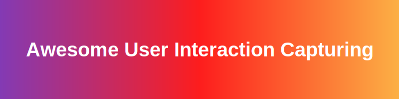

<!-- SEO: awesome list, user interaction, session replay, heatmaps, product analytics, open-source analytics, SaaS analytics, Matomo, PostHog, Hotjar alternatives -->

🚀 # Awesome-User-Interaction-Capturing 🚀

🌟 ## Top User Interaction Capturing and Analytics Tools & Open-Source Alternatives

A curated guide to leading **SaaS/cloud-hosted user interaction capturing and analytics tools** (like PostHog, Matomo, Mixpanel, Amplitude, LogRocket, FullStory, Contentsquare, Glassbox, Smartlook, Pendo) and their **open-source/self-hosted equivalents**. 

**Open-source solutions are emphasized** for privacy, customization, session replay, heatmaps, and full data control.

---

☁️ ## SaaS / Cloud-Hosted User Interaction Tools

Popular platforms for session replay, heatmaps, rage clicks, user behavior analytics, and product experience insights.

🏆 ### Leading Options & Notables

| Tool | Description | Pricing | Free Tier Limit | Company Size / Valuation |
|---|---|---|---|---|
| **Microsoft Clarity** | Session replay and heatmaps. | Free | Unlimited | ~$3 Trillion (Microsoft) |
| **Hotjar** | User behavior analytics and feedback tool. | Freemium / Usage-based | 35 daily sessions | ~$5.4 Billion (Contentsquare) |
| **[Contentsquare](https://contentsquare.com)**| Enterprise session replay and digital experience analytics. | Custom / Enterprise | None | ~$5.4 Billion |
| **[Pendo](https://pendo.io)** | Mobile/web heatmaps, recordings, and in-app guidance. | Freemium / Usage-based | 500 MAUs | ~$2.6 Billion |
| **[FullStory](https://fullstory.com)** | Enterprise session replay and digital experience analytics. | Freemium / Custom | 30,000 sessions/mo | ~$1.8 Billion |
| **[Amplitude](https://amplitude.com)** | Event-based behavioral analytics with strong visualization. | Freemium / Usage-based | 10,000 MTUs, 2M events/mo | ~$1.5 Billion |
| **[Mixpanel](https://mixpanel.com)** | Event-based behavioral analytics with strong visualization. | Freemium / Usage-based | 20M events/mo | ~$1.05 Billion |
| **[PostHog](https://posthog.com)** | All-in-one with session replay, product analytics, feature flags, and A/B testing. | Freemium / Usage-based | 1M events, 5k replays/mo | ~$1 Billion |
| **[Glassbox](https://glassbox.com)** | Enterprise session replay and digital experience analytics. | Custom / Enterprise | None | ~$400 Million |
| **[LogRocket](https://logrocket.com)** | Session replay with debugging and performance insights. | Freemium / Usage-based | 1,000 sessions/mo | ~$200 Million |
| **[Smartlook](https://smartlook.com)** | Mobile/web heatmaps, recordings, and in-app guidance. | Freemium / Usage-based | 3,000 sessions/mo | ~$50 Million |
| **[Matomo](https://matomo.org)** | Privacy-focused analytics with heatmaps and session recordings. | Paid (Cloud) / Free (Self-hosted) | None (Cloud) | ~$10 Million |

These tools help identify UX issues, understand user journeys, and optimize product engagement.

---

🔓 ## Open-Source / Self-Hosted Alternatives

These provide session replay, heatmaps, analytics, and interaction tracking with complete data ownership.

⭐ ### Featured Projects

- **[Umami](https://umami.is)**  — Simple, self-hosted web analytics with clean dashboards.
- **[PostHog](https://posthog.com)**  — Leading open-source platform with session replay, autocapture, heatmaps, product analytics, and feature flags. Self-host or cloud.
- **[Matomo](https://matomo.org)**  — Full-featured open-source analytics with heatmaps, session recordings, and privacy controls. Self-hosted option is powerful.
- **[Plausible](https://plausible.io)**  — Lightweight privacy-focused analytics (web-focused, extensible).
- **[OpenReplay](https://openreplay.com)**  — Open-source session replay and analytics suite with dev tools, rage click detection, and performance monitoring.

### Additional Open-Source Tools
- **rrweb** — Core library for web session recording and replay (used in many tools).
- **Hotjar open-source alternatives** and heatmap libraries (e.g., via custom implementations with PostHog plugins).
- **Apache Superset** or **Grafana** for custom visualization on top of captured data.
- Various GitHub projects for rage-click detection, user journey mapping, and interaction analytics.

**Tip**: **PostHog** and **OpenReplay** offer the closest open-source experience to commercial session replay tools. Combine with **Matomo** for comprehensive analytics.

---

⚖️ ## Comparison

| Aspect              | SaaS Platforms                        | Open-Source / Self-Hosted                  |
|---------------------|---------------------------------------|--------------------------------------------|
| **Cost**            | Usage-based (sessions/events)         | Free (only infra costs)                    |
| **Customization**   | Limited APIs                          | Full control over recording & analysis     |
| **Privacy**         | Vendor processes data                 | Complete sovereignty & compliance          |
| **Setup Effort**    | Quick SDK integration                 | Self-hosting required                      |
| **Use Case**        | Teams needing polished UX insights    | Privacy-first, custom, or budget-conscious teams |

---

🏁 ## Getting Started

1. Define requirements (session replay, heatmaps, autocapture, mobile support).
2. Deploy **PostHog** for a full open-source suite or **OpenReplay** for focused replay capabilities.
3. Use **Matomo** as a GA4 + recordings alternative.
4. Host on Docker/Kubernetes and integrate SDKs into your apps.
5. Focus on data retention policies and GDPR compliance.

🤝 ## Contributing

Feel free to submit PRs to expand this list with more projects, tools, or comparisons!

**Last updated**: July 2026  
*User analytics and privacy regulations evolve quickly — always check the latest on official sites and GitHub repos.*

